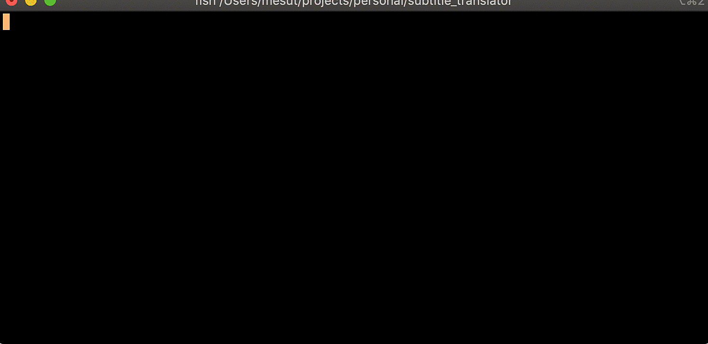

subtitle_translator
===================

Translate bunch of subtitles from original language to desired language. This gives you a machine translated subtitle.



Make sure you have Python 2.7 or above installed
Check Python:
```shell
python --version
```

Clone the project:
```shell
git clone https://github.com/gunesmes/subtitle_translator.git
```

# To run the translater
* install the requirements
* you must have a valid subtitle in .srt format
* You can use Google translator or yandex
* For yandex you must have Yandex Translater API key. You can get it from here: http://api.yandex.com/key/keyslist.xml

* Go to project folder and run python file
```shell
# Go to project path
cd /path/to/project

# install the reqirements
pip install -r requirements.txt

# translate files in the provided path 
python run.py <path/to/files> <max-length-of-lines> <translator:google or yandex> <source language> <target language>
python run.py "/Users/mesutgunes/Projects/subtitle_translator" 40 yandex pl tr
````

- Don't wory about source language, translater can understand it.
- Check language abbreviation: https://developers.google.com/translate/v2/using_rest#language-params
- The .srt files in the given directory are to be translated to target language 
